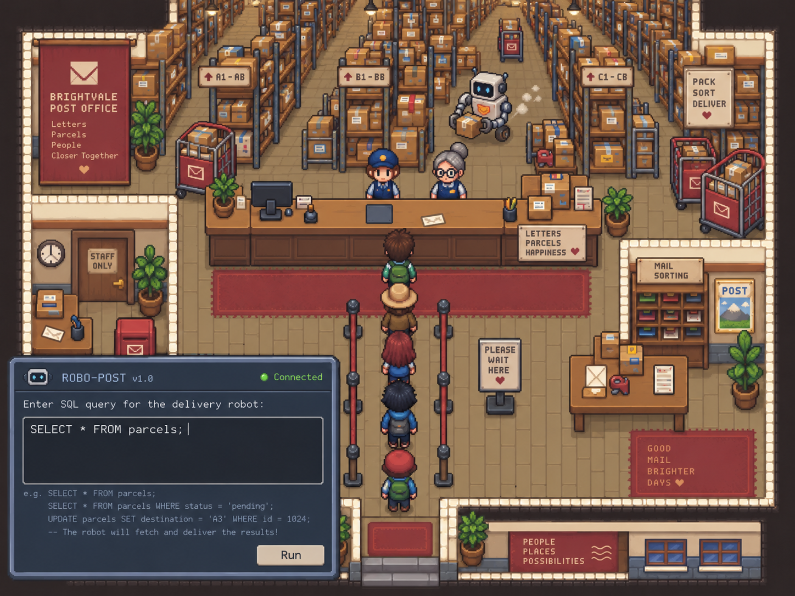

# Практична робота №1

> Уточнення реалізації v0.2.0 мають пріоритет: −5 з майбутньої оплати клієнта, не з wallet; клієнти не вимагають набору колонок; рух робота сповільнено. Актуальні правила: [MVP backlog](mvp-backlog.md) та [README](../../README.md).

## Створення проєкту гейміфікації процесу навчання

**Робоча назва: SQL Post.** Альтернатива для вибору: «Посилка за запитом».

> Робочий контекст для наступних чатів і розробки. Передфінальний DOCX містить відібраний текст для здачі; відсутність ідеї в DOCX не означає її відхилення. Явні правки користувача мають пріоритет. Запас невибраних ідей збережено нижче, але вони не є обов’язковим scope MVP.
>
> Актуальні рішення від 15.09.2026: single-player; затишне поштове відділення; одна кнопка Run запускає робота, автоматичний preview показує вибірку до натискання; 13 клієнтів = 12 основних + останній багатий клієнт; він ЗАБИРАЄ золоту коробку й платить більше. Після трьох неправильних видач клієнт іде. За неправильну видачу −5 монет. Для наступного рівня потрібно 3★; останній клієнт на зірки не впливає. Декоративна коробка після трьох пройдених рівнів — окрема майбутня механіка.

### Тема

Розроблення концепції гейміфікації навчального процесу.

### Мета роботи

Ознайомитися з основними принципами гейміфікації та навчитися проєктувати систему ігрових механік для підвищення мотивації, активності та залученості студентів у навчальний процес.

### Завдання

Розробити власний **проєкт гейміфікації навчального курсу або окремої навчальної дисципліни**.

Проєкт має перетворити традиційний процес навчання на систему, у якій студент отримує бали, досягнення, рівні, нагороди або інші ігрові стимули за виконання навчальних завдань.

### Головна ідея

SQL Post — навчальна гра, у якій гравець працює у вигаданому поштовому відділенні. Клієнт описує свою посилку заздалегідь підготовленою реплікою: називає номер, прізвище, ім’я, колір або інші відомості. **Гравець сам перетворює опис на SQL-запит** до бази складу. Під редактором автоматично відображається result set; після перевірки гравець натискає єдину кнопку Run, і робот привозить вибрані коробки.

Рівні послідовно вводять синтаксис, а знайомі конструкції повертаються в повторних замовленнях. Монети, зірки й досягнення підтримують практику. Грати можна самостійно або під час навчального заняття: основний користувач — гравець, а викладач і навчальна група — можливий контекст використання.

## Хід роботи

### 1. Обрати навчальну дисципліну

**Дисципліна:** SQL, отримання даних за допомогою DQL. Навчальне ядро — `SELECT` та його складові: `FROM`, `WHERE`, `ORDER BY`, `LIMIT`, далі агрегатні функції, `GROUP BY`, `HAVING`, `JOIN`.

**Цільова аудиторія:** люди, які поверхнево ознайомилися з теорією SQL, але потребують практики. Професія Data Analyst не є передумовою. Початкові поняття таблиці, рядка та стовпця коротко пояснюються у вступі.

**Тривалість:** орієнтовно 5–10 хвилин на рівень; стартова гіпотеза — 13 клієнтів. У першій версії один рівень. Фактичний час і кількість клієнтів уточнюються на playtest; це ціль темпу, а не таймер.

**Результати навчання — кандидати відповідно до реалізованих тем:**

1. Самостійно написати `SELECT … FROM …`.
2. Розрізняти вибір стовпців і відбір рядків.
3. Знайти посилку за заданою умовою.
4. Поєднати кілька умов і перевірити їхню логіку.
5. Упорядкувати результат та обмежити кількість рядків.
6. Отримати підсумкові значення для набору та окремих груп.
7. Поєднати дані двох таблиць за ключем.
8. Виправити запит на основі повідомлення про помилку або невідповідного результату.

MVP охоплює результати 1–3 і базове виправлення помилок. Решта належить до наступних рівнів.

### 2. Визначити проблему

#### 2.1. Проблеми навчальної мотивації

**Вимога завдання:** «Проаналізуйте, які проблеми навчальної мотивації має вирішити гейміфікація».

Нижче 8 кандидатів для вибору 2–4. Це гіпотези про мотивацію цільової аудиторії; їх не слід представляти як доведені проблеми всіх початківців.

| Проблема мотивації | Як її має зменшити гра |
| --- | --- |
| 1. Важко почати самостійну практику після теорії | Колега проводить через перших клієнтів, потім допомога скорочується |
| 2. Одноманітні вправи швидко набридають | Короткі замовлення, різні репліки та реакції персонажів |
| 3. Немає бажання повертатися до вже вивченого | Чотири замовлення на повторення вбудовано у наступну зміну |
| 4. Прогрес не відчувається | Зірки й доступ до нової теми показують завершення етапу |
| 5. Помилки знижують упевненість і бажання продовжувати | Безштрафний preview дозволяє виправити SQL до видачі, колега пояснює помилку |
| 6. Великий обсяг матеріалу демотивує | Матеріал розділено на короткі рівні з поступовим ускладненням |
| 7. Незрозуміло, навіщо ще раз писати знайому конструкцію | Кожне замовлення дає конкретний ігровий результат і монети |
| 8. Після першого проходження немає наступної особистої мети | Кращі зірки, бонусний клієнт і пізніше косметичні нагороди |

Для короткого DOCX пропонуються 2, 3, 4, 5. Технічні труднощі нижче пояснюють, чого навчає гра; цей підпункт пояснює, навіщо гравець продовжує практику.

#### 2.2. Труднощі опанування SQL та відповіді продукту

Дослідження описують труднощі із синтаксисом, назвами таблиць і стовпців, агрегацією та уявленням про результат SQL. Це спостереження конкретної вибірки, а не доказ, що кожну проблему має більшість користувачів. [Miedema et al., 2021](https://pure.tue.nl/ws/portalfiles/portal/362307007/3446871.3469759.pdf).

Інше дослідження виявило труднощі переходу від плану розв’язання до SQL-коду. Це підтримує наш фокус на самостійному написанні запитів після прикладу. [Shin, 2022](https://pubmed.ncbi.nlm.nih.gov/36438342/).

**8 кандидатів; для фінальної роботи залишити 2–4.** Рішення в останньому стовпці — наші проєктні пропозиції; їхній ефект ще потрібно перевірити.

| № | Проблема | Прояв | Відповідь у грі |
| --- | --- | --- | --- |
| 1 | Теорія не переходить у самостійне написання | Приклад зрозумілий, але власний запит не складається | Показ колеги → часткова допомога → самостійне замовлення |
| 2 | Плутанина між рядками та стовпцями | Замість фільтра змінюється перелік полів | Рядки показані як коробки, стовпці — як поля їхніх карток |
| 3 | Помилки структури SQL | Пропущені слова, коми, неправильний порядок частин | Підсвічування місця помилки й коротке пояснення |
| 4 | Виконуваний запит має неправильний результат | Зайві або пропущені коробки | Видимий result set, підсвічування коробок і пояснення невідповідності |
| 5 | Плутанина між сортуванням і групуванням | Від ORDER BY та GROUP BY очікується однаковий ефект | Сортування змінює чергу, групування показує підсумки за секторами |
| 6 | Недостатнє повторення — гіпотеза | Синтаксис забувається між сесіями | Раніше вивчене повертається в наступних замовленнях |
| 7 | Копіювання підміняє практику — гіпотеза | Без готового прикладу користувач зупиняється | Підказки скорочуються, дані завдань змінюються |
| 8 | Страх помилок або нудьга — гіпотеза | Користувач припиняє спроби | Безштрафні пробні запити, гумор і винагорода за кожен успіх |

Пріоритетна пропозиція: **1, 3, 4, 6** — практика, синтаксис, розуміння результату та повторення. Гіпотези перевіряються інтерв’ю і спостереженням за проходженням MVP. Відібрані дослідження не доводять, що недостатнє повторення є головною причиною труднощів саме нашої аудиторії.

### 3. Сформулювати цілі гейміфікації

**Основні цілі взято з DOCX; додаткові збережено для розвитку.** Пороги — початкові критерії pilot test, а не встановлені наукою норми чи вже отримані результати.

| № | Ціль | Перевірка |
| --- | --- | --- |
| 1 | Після рівня користувач самостійно виконує щонайменше 3 нові завдання на вивчений синтаксис | Окрема коротка перевірка без готової відповіді |
| 2 | Щонайменше 80% учасників pilot test успішно обслуговують усіх звичайних клієнтів першого рівня протягом не більш як двох проходжень | Частка серед усіх, хто почав; окремо фіксувати підказки |
| 4 | Щонайменше 70% учасників, які помилилися, виправляють запит після feedback без готової відповіді | Спостерігати наступні спроби після помилки |
| 5 | Через 3–7 днів користувач виконує щонайменше 2 із 3 нових завдань на ту саму тему | Добровільна повторна перевірка; вказати кількість тих, хто повернувся |
| 6 | Щонайменше 50% учасників добровільно обирають повторну практику після першої зміни | Запропонувати ще одну зміну з іншими даними й зафіксувати вибір |

Для MVP обрано три основні цілі: самостійне виконання нових завдань, виправлення після feedback і успішне проходження в межах двох спроб. Решта потребує додаткової сесії або контенту. Зірки та монети відображають ігровий успіх; засвоєння SQL перевіряється новими самостійними завданнями.

### 4. Створити ігровий сюжет

Гравець виходить на першу зміну у поштовому відділенні недалекого майбутнього. На складі працює робот, який отримує список потрібних посилок через SQL-термінал. Досвідчений колега показує перші запити й пояснює результат на перших клієнтах кожного рівня. Клієнти описують свої посилки: називають номер, прізвище або кілька прикмет. Гравець пише SQL, перевіряє автоматичний preview і натискає Run, щоб робот привіз вибрані коробки. Кожна наступна зміна вводить новий синтаксис і повертає вже знайомий, а правильне обслуговування приносить монети та прогрес до зірок. Останній багатий клієнт дає складніше замовлення, забирає свою золоту коробку й щедро платить; його обслуговування може також виконати додаткову місію.

Невибрана ідея для майбутнього: міжпланетне поштове відділення з інопланетними клієнтами. Поточний напрям — затишний склад із легким sci-fi, як у DOCX і референсі.

### 5. Розробити ігрові механіки

10 кандидатів у **трьох колонках**. Коротку таблицю для DOCX можна скласти з перших 7–8; місії та декор залишити в плані розвитку.

| Механіка | Правило та винагорода | Мотиваційний ефект |
| --- | --- | --- |
| SQL-керування роботом | Гравець пише SQL за описом клієнта; Run відправляє робота за вибіркою | Написаний запит має видимий наслідок |
| Рівні | Новий синтаксис відкривається після 3★ за попередній рівень | Зрозуміла найближча мета |
| Колега-наставник | Показує перші замовлення, далі допомога скорочується; показ не дає монет | Полегшує початок самостійної практики |
| Автоматичний preview | Показує result set під редактором без руху робота і штрафів | Дозволяє експериментувати перед дією |
| Спроби та реакції клієнта | Неправильна видача: −5 монет і одна спроба; після третьої клієнт іде | Спонукає перевіряти вибірку |
| Зірки | 0–3★ за кількість обслужених основних клієнтів | Видимий прогрес і привід повторити |
| Монети | +10 за легке/повторне, +20 за середнє, +30 за бонусне замовлення | Кожен правильний результат має цінність |
| Досягнення | Одноразовий badge за визначений успіх | Відзначає різні навички |
| Бонусний клієнт і місія | Клієнт забирає золоту коробку, платить +30; правильна видача зараховує місію | Додатковий виклик без впливу на зірки |
| Декор і коробка після 3 рівнів | Пізніше: покупки за монети або декоративний предмет із незатребуваної коробки | Довгострокова мета та персоналізація |

**Цикл:** репліка клієнта → власний SQL → автоматичний preview → перевірка/редагування → Run → робот привозить коробки → реакція клієнта → монети й прогрес.

**Одна кнопка Run.** Preview оновлюється після короткої паузи у введенні, наприклад 400–600 мс. Він показує фактичні дані, кількість рядків і заголовки стовпців, але не оцінює відповідність замовленню. Коли запит ще не завершено, UI показує нейтральне «Запит ще не завершено»; помилка не витрачає спробу. Старий preview після редагування не можна показувати як актуальний. Run працює лише з актуальним виконуваним запитом; повторне натискання під час руху робота заблоковане.

Для огляду схеми є постійно доступний список таблиць і полів: вибірка показує лише запитані стовпці, тому не замінює схему. У вступі SELECT * FROM parcels показує всі поля без доставки. Під час замовлення валідний запит із нульовим або зайвим результатом можна надіслати через Run — це вже оцінювана невдала спроба. Так гравець сам аналізує результат, а preview не видає готову відповідь.

Робот візуалізує result set, а не внутрішній алгоритм DBMS. SQL вибирає дані; рух і зміна ігрового стану виконуються грою.

### 6. Система монет і зірок

Правила з DOCX: за легке й повторне замовлення +10, за середнє +20, за бонусне +30, за неправильну видачу −5 монет. Окремого XP немає.

| Подія | Монети та наслідок |
| --- | --- |
| Показ колеги / автоматичний preview | 0; спроби не витрачаються |
| Правильне легке замовлення | +10 |
| Правильне замовлення на повторення | +10 |
| Правильне середнє замовлення | +20 |
| Правильне бонусне замовлення | +30; клієнт забирає золоту коробку |
| Неправильна видача після Run | −5 і мінус 1 спроба клієнта |
| Третя неправильна видача | Такий самий штраф −5; клієнт іде, додаткового штрафу немає |
| Синтаксична помилка / редагування | Без штрафу й руху робота |
| Повторне натискання після зарахування | Немає повторної виплати за те саме обслуговування |
| Купівля декору, після MVP | Віднімання ціни предмета |

**13 клієнтів:** 4 легкі + 4 середні + 4 на повторення + 1 бонусний останнім. Максимум без помилок: **4×10 + 4×20 + 4×10 + 30 = 190 монет**. На першому рівні блок повторення закріплює вступ і перші замовлення, оскільки попередніх рівнів ще немає. Колега може допомагати з першими легкими клієнтами; окремий показ до них не оцінюється.

Штраф прийнято з DOCX. Пропозиція для MVP: баланс не падає нижче нуля — списується до 5 доступних монет; це запобігає боргу на старті. Вихід не скасовує вже нараховані винагороди та застосовані штрафи. Повторний прохід знову дає монети за виконані замовлення; найкращі зірки не зменшуються.

**Зірки рахуються тільки за 12 основних клієнтів.** За уточненням користувача залишаємо відсоткові орієнтири й додаємо кількість клієнтів. Інтервали покривають усі результати:

| Зірки | Частка основних клієнтів | Кількість із 12 |
| --- | --- | --- |
| 0★ | Менше 50% | 0–5 |
| 1★ | Від 50% до менш ніж 80% | 6–9 |
| 2★ | Від 80% до менш ніж 100% | 10–11 |
| 3★ | 100% | 12 |

80% від 12 — це 9,6, тому поріг 2★ дорівнює 10 клієнтам. Якщо кількість зміниться, пороги перераховуються з округленням угору. Бонусний клієнт не впливає на зірки; монети він дає навіть при низькій кількості зірок.

Для наступного рівня потрібні 3★, як обрано в DOCX. Після відходу клієнта рівень продовжується до підсумку, але для 3★ його потрібно пройти повторно. Строгий поріг може збільшити кількість повторів; поки зберігаємо це рішення й перевіряємо на playtest.

**Золота коробка — посилка клієнта, не нагорода гравця.** Вона знаходиться серед записів складу. Гравець отримує підвищену оплату, а місія фіксує факт правильної видачі. Майбутні місії: «Видати золоту посилку цього рівня» або «Виконати особливі замовлення у трьох різних рівнях». Інвентар золотих коробок не потрібен.

### 7. Розробити рівні

**10 рівнів замість мінімальних 5.** Це план розвитку, не scope MVP. Рівень — ігрова зміна з темою, а не ранг профілю. Доступ пропонується відкривати за проходження попереднього рівня; накопичення і витрачання монет не впливає на навчальний доступ.

| № | Назва | Новий синтаксис | Ігрова дія |
| --- | --- | --- | --- |
| 1 | Перша зміна | SELECT, FROM, вибір полів, WHERE = | Огляд реєстру, потім пошук коробки за номером |
| 2 | Особливі прикмети | >, <, <>, текстові значення | Вибір посилок за вагою, кольором або статусом |
| 3 | Точне замовлення | AND, OR, дужки | Вибір за кількома ознаками |
| 4 | Частина адреси | LIKE, IN, BETWEEN | Пошук за фрагментом, набором або діапазоном |
| 5 | Правильна черга | ORDER BY, ASC, DESC | Посилки подаються у заданому порядку |
| 6 | Маленький візок | LIMIT разом з ORDER BY | Вибір перших N посилок із визначеної черги |
| 7 | Перевірка вантажу | COUNT, SUM, MIN, MAX, AVG | Робот сканує вибірку, показує кількість або вагу |
| 8 | Сектори складу | GROUP BY з агрегацією | Окремі картки кількості/ваги для кожного сектору |
| 9 | Великі партії | HAVING; повторення WHERE | На дисплеї залишаються групи із потрібним підсумком |
| 10 | Хто одержувач? | INNER JOIN, ON, aliases | Поєднання клієнтів і посилок за customer_id |

Рівень 1 доступний зі старту, кожен наступний — після 3★ за попередній. Усередині тем із кількома конструкціями матеріал вводиться окремими кроками. Якщо тема не вкладається в коротку сесію, її потрібно розділити на кілька змін.

GROUP BY не повертає автоматично список конкретних коробок: у таких рівнях гравець передає клієнту підсумок перевірки, а робот його візуалізує. Це продовжує практику SQL, але трохи розширює початковий сценарій видачі.

LIMIT без ORDER BY не гарантує потрібні «перші» записи. Для однозначної черги за вагою можна додати id як другий ключ сортування. Семантику звірено з [документацією SELECT](https://www.postgresql.org/docs/current/sql-select.html).

LEFT JOIN, NULL, DISTINCT, підзапити, CTE та window functions — можливе подальше розширення. Вони не входять до MVP.

### 8. Розробити систему нагород

**10 кандидатів замість мінімальних 5.** Кожне досягнення дає badge один раз, без додаткових монет.

| № | Назва | Умова |
| --- | --- | --- |
| 1 | На зв’язку | Самостійно обслужити першого клієнта після tutorial |
| 2 | Працівник дня | Обслужити всіх звичайних клієнтів першого рівня |
| 3 | Помилку виправлено | Після невдалої спроби виправити SQL та обслужити клієнта |
| 4 | Без зайвих коробок | Виконати три різні замовлення на фільтрацію |
| 5 | Майстер черги | Завершити контрольне замовлення на ORDER BY |
| 6 | Точно за місткістю | Завершити замовлення на ORDER BY + LIMIT |
| 7 | Усе пораховано | Виконати контрольне завдання з агрегатною функцією |
| 8 | Кожному сектору своє | Виконати контрольне завдання на GROUP BY |
| 9 | Адресата знайдено | Виконати контрольне завдання на JOIN |
| 10 | Золота доставка | Правильно видати золоту коробку бонусному клієнту |

Для MVP достатньо досягнення 1; решта — варіанти розвитку.

Косметичні нагороди: колір робота, кепка, наклейка на корпус, рослина біля стійки, оформлення термінала. Вони не підвищують оцінки й не відкривають синтаксис. Ціни визначаються після перевірки заробітку монет.

#### Після MVP — незатребувана коробка з декором

Після перших проходжень трьох різних рівнів відкривається сцена: за правилами вигаданої пошти списана незатребувана коробка переходить працівнику. Усередині — предмет для оформлення відділення або робота. Вона не пов’язана із золотою посилкою багатого клієнта. Назва «незатребувана» точніше передає задум, ніж «прострочена».

Для початку достатньо однієї нагороди після рівня 3; пізніше — після кожних трьох нових пройдених рівнів. Перепроходження одного рівня не збільшує цей лічильник. Фіксований предмет простіший у реалізації; випадковий предмет із захистом від дублів — окреме можливе розширення. Це майбутня ідея, не частина MVP.

### 9. Створити приклад навчального квесту

**Навчальний квест — одна робоча зміна (рівень).** Число клієнтів не потрібно штучно скорочувати до п’яти через Пр 2: у ній згодом можна показати п’ять блоків рівня. Це потребує окремого узгодження балів і форм завдань.

**Назва:** «Перша зміна».

**Мета:** написати SELECT … FROM, вибрати поля та застосувати WHERE = для пошуку посилки.

**Передумови:** колега пояснює схему таблиці, preview і Run; показує огляд реєстру та видачу на перших клієнтах.

**Завдання:** обслужити клієнтів за їхніми текстовими описами. Для MVP достатня таблиця parcels(id, first_name, last_name, color, shelf, weight_kg). Один рядок — одна посилка, id унікальний. Текстові поля вводяться з поясненням лапок. Для пошуку за прізвищем, ім’ям чи кольором використовується відповідний стовпець.

**Кількість етапів:** 13 клієнтів; 5 блоків у таблиці нижче не означають 5 клієнтів.

| Блок | Зміст | Максимум монет |
| --- | --- | --- |
| 1. Чотири легкі | Пошук за номером із поступовим скороченням допомоги | 40 |
| 2. Два середні | Пошук за прізвищем, текстова умова, вибір потрібних полів | 40 |
| 3. Ще два середні | Пошук за іншою вже поясненою одиничною ознакою | 40 |
| 4. Чотири повторні | Закріплення вступу й попередніх замовлень; у наступних рівнях — минулих тем | 40 |
| 5. Один бонусний | Специфічний опис у межах уже вивченого; видача золотої коробки | 30 |

**Максимум монет:** 190 до штрафів.

**Нагорода:** монети за кожного обслуженого клієнта, 0–3★ за 12 основних; правильна видача золотої коробки може зарахувати місію.

**Критерії проходження:** 3★ означають, що обслужено 12 основних клієнтів. Це критерій гри; засвоєння теми перевіряється новими завданнями без готового SQL, а не проголошується за самими зірками.

#### Як текст клієнта перетворюється на завдання

Репліки заготовляються разом із даними та умовою правильної відповіді. SQL пише гравець — AI-переклад репліки не потрібен.

| Репліка | Навичка / приклад SQL |
| --- | --- |
| «Моя посилка №1042» | SELECT * FROM parcels WHERE id = 1042; |
| «Посилка на прізвище Коваль» | SELECT * FROM parcels WHERE last_name = 'Коваль'; |
| «Я Олена, коробка синя» | Після введення AND: SELECT * FROM parcels WHERE first_name = 'Олена' AND color = 'синя'; |
| «Візьму дві найлегші мої посилки» | Пізніші теми: WHERE, ORDER BY weight_kg, id та LIMIT 2 |

Фраза повинна давати достатньо даних. Якщо в базі кілька Ковалів, а клієнт очікує одну коробку, потрібно змінити дані або дати ще одну ознаку, а не карати за об’єктивно неоднозначне завдання. Якщо потрібні всі його коробки, це прямо сказано у репліці. На рівні 1 бонус використовує одну умову; ім’я + колір з’являються після вивчення AND.

Золота коробка не має бути відповіддю за замовчуванням лише через її колір: у пізніших завданнях можуть бути кілька золотих коробок різних клієнтів. У першому рівні достатня однозначна ознака власника й перенесення знайомої конструкції на інше поле. Складний фінал не вимагає невивченого синтаксису.

Preview показує фактичний result set. Правильність видачі перевіряється за очікуваними рядками та, де зазначено, полями; не за буквальним збігом SQL. Без ORDER BY порядок не оцінюється. Для руху робота результат має містити id; цю вимогу пояснює tutorial. Ігровий набір даних узгоджений із видимими посилками; preview не приховано фільтрується під поточного клієнта.

**Запасний сценарій:** «Маленький візок» — той самий формат 13 клієнтів для теми LIMIT із повторенням WHERE та ORDER BY. Візок бере задану кількість посилок; останній клієнт просить свою золоту посилку за складнішим описом. Навчальна мета — кількість і порядок вибірки, передумови — попередні теми, критерій 3★ — 12 основних клієнтів, максимум за тим самим балансом — 190 монет.

**Пр 2:** її максимум 90 навчальних балів відрізняється від 190 ігрових монет. Можлива майбутня адаптація — п’ять блоків із вагами 10/10/20/20/30, але це окрема шкала роботи, не автоматична заміна монет. Остаточне оформлення Пр 2 ще не виконано.

### 10. Створити прототип системи

Це попередній візуальний референс. Він ще не показує актуальні preview, прогрес і нагороди; приклад UPDATE на ньому потрібно прибрати у майбутньому макеті. Саме зображення не редагувалося.

**Пропозиція основного екрана, 16:9:** теплий pixel art для світу, чіткий monospace для SQL та звичайний читабельний шрифт для UI. Верхні 8% висоти — статус. Нижче ліві 58% ширини — склад, праві 42% — термінал. Так редактор не закриває клієнта й маршрут робота.

| Зона | Елементи |
| --- | --- |
| Верхня смуга | Аватар/нік; «Рівень 1»; «Клієнт 5/13»; «Обслужено 4/12»; зірки; монети; пауза |
| Ліворуч | Склад, полиці з номерами, стійка, поточний клієнт, робот, 2–3 видимі люди в черзі |
| Праворуч угорі | Портрет клієнта, повна репліка, «Спроби 3/3»; підказка колеги за потреби |
| Праворуч посередині | Компактна схема parcels; SQL-редактор на кілька рядків |
| Під редактором | Автоматичний preview: заголовки, 3–5 видимих рядків, прокрутка, загальна кількість знайдених |
| Праворуч унизу | Єдина кнопка Run і підпис «Робот привезе вибрані посилки»; повідомлення про результат |

Preview не має позначки «відповідь правильна» до Run. Підсвічування коробок після Run показує наслідок вибірки. У tutorial можна підсвітити зв’язок рядка та коробки. Основний екран не повинен показувати всю чергу з 13 людей одночасно.

Для повного покриття вимог Пр 1 потрібні ще **дві невеликі панелі** на окремому аркуші прототипу: вибір рівня з доступними змінами й профілем; підсумок із зірками, монетами, досягненням і статусом бонусного замовлення. Магазин — у плані розвитку, без активного екрана в MVP.

**Готове завдання для майбутньої генерації:** широкий 16:9 UI-макет SQL Post, затишне поштове відділення в теплому pixel art з бордовими та дерев’яними деталями, дружній робот; зверху статус, ліворуч склад і клієнт, праворуч опис замовлення, схема таблиці, SQL-редактор, під ним табличний preview, внизу одна кнопка Run. Без другої кнопки підтвердження; без UPDATE; без накладання термінала на клієнта. Приклад стану: клієнт назвав номер 1042, у редакторі SELECT * FROM parcels WHERE id = 1042;, preview містить відповідний рядок. Генерація має задати композицію; точний текст і SQL доцільно накласти окремо під час оформлення, щоб уникнути помилок у написах.

**MVP:** один склад, простий рух робота між фіксованими точками, реальна локальна SQL-база, автоматичний preview, одна кнопка Run, tutorial, 13 заготовлених клієнтів, три спроби, монети зі штрафом, зірки, підсумок і збереження. Останній клієнт забирає золоту коробку та платить +30; окрема система місій, декор і незатребувані коробки — після MVP. Точне число клієнтів змінюємо лише за результатом playtest, стартуємо з 13.

## Результат роботи

Концепція SQL Post охоплює дисципліну DQL, цільову аудиторію, мотиваційні проблеми, вимірювані цілі, сюжет, механіки, монети, зірки, десять тем рівнів, нагороди, приклад зміни з 13 клієнтами та план візуального прототипу. Основний сюжет і правила оновлено за передфінальним DOCX; додаткові ідеї збережено для майбутньої розробки.

Очікуваний результат — самостійне написання SQL за описом посилки та розуміння отриманої вибірки. Ефект навчання ще потрібно перевірити; готового застосунку й нового згенерованого прототипу наразі немає.

## Форма подання

**Презентація — 8–12 слайдів:** наступний етап після вибору змісту та візуального напряму.

**Короткий опис — 1–2 сторінки:** цей документ є розширеною основою. Після вибору потрібно прибрати альтернативи, робочі примітки й зайві деталі та скоротити текст до ліміту. Поточна чернетка навмисно довша.

## Додаткове завдання ⭐

**Ризики гейміфікації та 6 способів їх зменшити.**

| № | Ризик | Рішення |
| --- | --- | --- |
| 1 | Страх помилок через відхід клієнта | Безштрафний автоматичний preview; Run виконує видачу; зрозуміло показувати решту спроб |
| 2 | Копіювання без розуміння | Після показу змінювати дані та давати самостійне замовлення |
| 3 | Монети за натискання замість практики | Одна виплата за клієнта в межах спроби; повторення дозволене через нове проходження |
| 4 | Бонус блокує початківця | Три зірки доступні без останнього клієнта |
| 5 | Оцінюється швидкість друку замість SQL | Без таймера; перевіряти правильність, не швидкість вводу |
| 6 | SQL сприймається як фізичне переміщення коробок | Показувати result set і пояснювати різницю між вибіркою та дією робота |

## Питання для захисту

1. **Що таке гейміфікація навчання?** Використання ігрових елементів для підтримки навчальних дій; тут зірки, монети та досягнення підтримують практику SQL.
2. **Чим вона відрізняється від навчальної гри?** Гра має власний світ, правила й ігровий цикл. SQL Post є навчальною грою з гейміфікацією прогресу — свідомою адаптацією завдання.
3. **Які механіки використано?** SQL-керування роботом, рівні, tutorial, feedback, спроби видачі, монети, зірки та досягнення.
4. **Чому саме вони?** Підтримують цикл «написати → побачити → виправити → повторити».
5. **Як мотивується гравець?** Видимий результат запиту, винагорода за кожного обслуженого клієнта, досяжна основна мета й додатковий виклик.
6. **Які ризики?** Страх помилок, копіювання, гонитва за монетами та хибне уявлення про SQL; способи зменшення наведено вище.
7. **Як перевірити ефективність?** Новими самостійними завданнями одразу та після перерви, окремо від ігрових нагород.
8. **Як адаптувати складність?** Поступово скорочувати підказки, залишати довідку й необов’язковий бонус.
9. **Що після перерви чи втрати мотивації?** Зберегти монети та прогрес, дозволити повторити вступ, не карати за відсутність.
10. **Як використати у навчальному закладі?** Як практичний тренажер до теми SQL; для самостійного проходження навчальний заклад не потрібен.

### Логічний результат роботи

Приклад колеги → опис клієнта → власний SQL → автоматичний preview → виправлення → Run і видача роботом → реакція клієнта → монети й зірки → повторення та новий синтаксис.

### Відкриті рішення

- Відсоткові орієнтири зірок доповнено точними інтервалами клієнтів. Нижня межа балансу 0 залишається пропозицією.
- Для GROUP BY та агрегатів збережено опис із DOCX: підсумки на дисплеї робота, а не видача однієї коробки.
- Пр 2 оформлюється пізніше: її п’ять завдань і 90 балів не змінюють автоматично 13 клієнтів і 190 монет гри.
- Рейтинг і командні змагання у таблиці механік DOCX виглядають залишками шаблону, бо погоджено single-player. У чернетці їм не надано статусу погоджених механік; запропоновано заміну на актуальну таблицю пункту 5.
